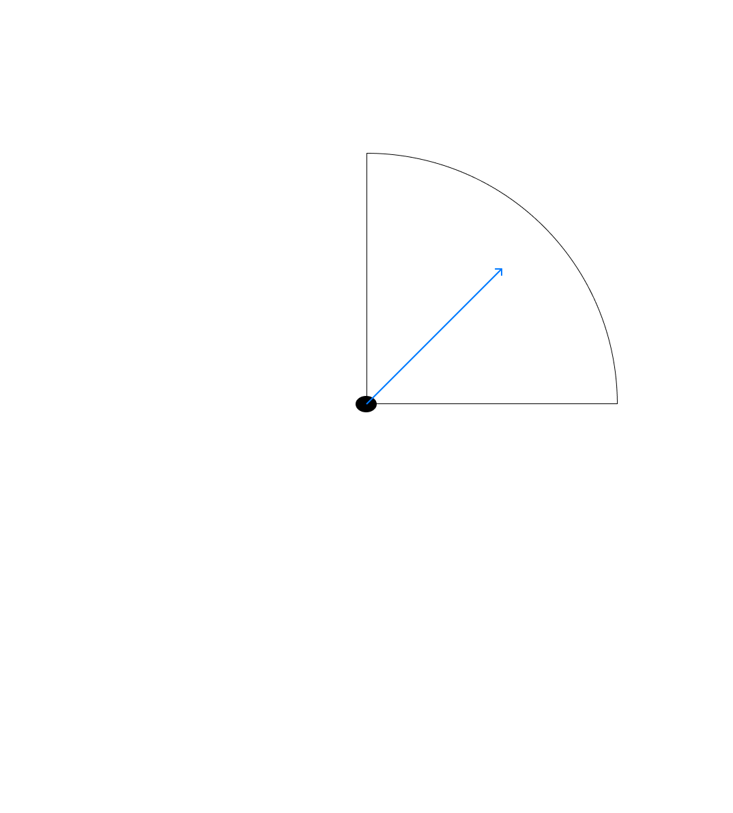

ㄴ배치자체
ㄴ자유자재로ㄱㄱ.!!!
ㄴ파생자체로
ㄴ근본이
ㄴ작은경우들이있음.
ㄴ이런경우들
ㄴ당해개념을
ㄴ순서를
ㄴ아싸리
ㄴ바꿔서
ㄴ재배치형식으로갈수있으나.
어원
ㄴ따지다보면
ㄴ당해형식이
ㄴ역순으로감.
ㄴ범주가큰것부터에서
ㄴ작은것으로감이
ㄴ표하기에
ㄴ정리하기에
ㄴ정렬하기에좋으나.
필연적으로
ㄴ어원자체를
ㄴ따지다보면
ㄴ작은것에서
ㄴ큰것으로
ㄴ연결되어
ㄴ당해순서가
ㄴ좌우
ㄴ좌측부터우측으로
ㄴ여기서
ㄴ역순으로됨.
당해
ㄴ역순개념자체
ㄴ때문에
ㄴ계속배치
ㄴ뒤집기
ㄴ이런식으로가나.
그것보다
ㄴ연속화
ㄴ연속성주어
ㄴ아싸리
ㄴ연결시켜버릴것.
그러면
ㄴ너무도자유자재롭게
ㄴ드나들며
ㄴ그개념자체로
ㄴ온전히
ㄴ싹다다잡힘

일반적으로는
ㄴ정리적으로는
ㄴ(>)형식이좋고
ㄴ편함.
ㄴ정합성있기에.
그러나
ㄴ어원적으로는
ㄴ(<)이런식의개념이많고.
ㄴ인간또한
ㄴ오히려
ㄴ이런쪽이기에.
ㄴ더하여
ㄴ범주적으로
ㄴ더확장한다라고하면
ㄴx축y축형식이
ㄴ너무도자연스럽기에.
ㄴ여기서배치되는부분을
ㄴ아싸리
ㄴ통합시켜서
ㄴ쭉갈것.
그럼에도
ㄴ여기서중한것은
ㄴ결국
ㄴ큰것에서작은것으로
ㄴ여기가
ㄴ끝선
ㄴ혹은정리선.
ㄴ분기점.
ㄴ이론점.
ㄴ고정점.
ㄴ딱이곳이라는것.
ㄴ확장하는곳아닌.
ㄴ축소하는곳이
ㄴ이론적형태라는것.!!!
ㄴ절대잊지말것
결론
ㄴ확장형연속화
ㄴ축소형기준화
