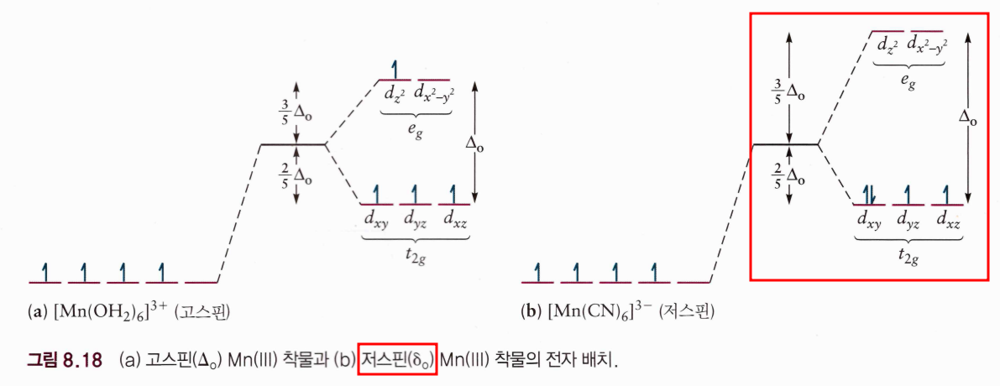

- 고스착물
- 고스핀전자배치정팔면체착물
- 고스핀정팔면체
- 고스핀정팔면체착물
- 고스핀착물
- 고착물
- 고핀착물
- 약장정팔면체착물
- 약한장정팔면체착물
- 저갈라짐정팔면체착물
- $\Delta_o$

    <pre>
        최적특정
        ㄴ고스핀
        ㄴ고스핀>>약한장
        ㄴ고스핀>>저갈라짐
        ㄴ고스핀>>갈라짐작음
        ㄴ고스핀>>결정장갈라짐에너지작음
    </pre>
    <pre>
        약한장
        ㄴ그냥
        ㄴ묶어다가넣어둘것.!!!
        ㄴ고스핀
        ㄴ여기다묶어서
        ㄴ퉁쳐버릴것.
        ㄴ나중에필할때
        ㄴ꺼내는식으로.
        개념자체는
        ㄴ고스핀
        ㄴ얘로만한정특정ㄱㄱ.!!!
        ㄴ이래야지잡힘.!!!
        더하여
        ㄴ개념준위
        ㄴ굳이하나더만드는것
        ㄴ더줄이기.
        ㄴ많을수록
        ㄴ오히려더독임.
        다채로울수있으나
        ㄴ다채성은
        ㄴ혼선으로이어짐.!!!
        ㄴ그혼선은
        ㄴ내모가지로들어오고.
        결론
        ㄴ개념자체도
        ㄴ줄이기ㄱㄱ.!!!
    </pre>

